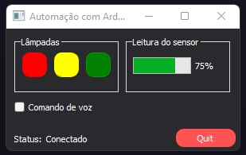

# Automação com Python e Arduino

<!---Esses são exemplos. Veja https://shields.io para outras pessoas ou para personalizar este conjunto de escudos. Você pode querer incluir dependências, status do projeto e informações de licença aqui--->




## Demo:

[Vídeo de demonstração](<video src="https://raw.githubusercontent.com/ricardoracki/automacaoPythonArduino/main/assets/videos/demo.mp4" width=300 />)

> Este projeto foi desenvolvido em caráter de estudo.

### Ajustes e melhorias

O projeto ainda está em desenvolvimento e as próximas atualizações serão voltadas nas seguintes tarefas:

- [ ] Implementação de fala para melhorar a questão de acessibilidade
- [ ] Melhoramento no fechamento do programa quando o reconhecimento de voz estiver habilitado
- [ ] Adicionar mais comandos de voz

### Bibliotecas utilizadas

- PyQt5
- pyserial
- SpeechRecognition

## 🚀 Instalando

Para instalar, siga estas etapas:

Windows:

```
pip install -r requirements.txt
```

## ☕ Usando Automação com Python e Arduino

Para dar start no projeto como desenvolvedor use o comando:

```
python main.py
```

Caso faça alguma alteração no `design.ui` como qtDesigner, rode o comando para atualizar:

```
pyuiC5 design.ui -o design.py
```

## 📝 Licença

Esse projeto está sob licença. Veja o arquivo [LICENÇA](LICENSE.md) para mais detalhes.

[⬆ Voltar ao topo](#youtube-downloader)<br>
